  

  
  ### Desenvolvimento Premium de Software para Empresas que Pensam Grande
  
  
  
  
  
  ---
  
  **Transformamos visões em sistemas web de alta performance que escalam com seu negócio**
  

## 🎯 Sobre Nós

Somos especialistas em desenvolvimento de software premium, focados em entregar soluções tecnológicas que impulsionam o crescimento de empresas ambiciosas. Com mais de **9 anos de experiência** no mercado, já atendemos **100.000+ usuários** e mantemos uma taxa de satisfação de **98%**.

### 💡 Nossa Filosofia

> "Não entregamos apenas código. Entregamos soluções estratégicas que transformam negócios."

Acreditamos que tecnologia deve ser um diferencial competitivo, não apenas uma ferramenta. Por isso, cada projeto é tratado com atenção exclusiva, arquitetura robusta e design pensado para conversão.

## 🚀 Serviços

### 🛍️ E-commerce Premium
Lojas virtuais de alta conversão com gestão inteligente e experiência de compra otimizada.

**Tecnologias:**
- Frontend moderno e responsivo
- Checkout otimizado para conversão
- Integração com múltiplos gateways de pagamento
- Dashboard analítico em tempo real
- SEO e performance garantidos

### 🏢 Sites Institucionais
Presença digital que transmite credibilidade e converte visitantes em clientes.

**Diferenciais:**
- Design exclusivo e personalizado
- CMS intuitivo para atualizações
- Otimização para mecanismos de busca
- Integração com CRM e automações
- Performance e segurança de nível empresarial

### ⚡ Sistemas Web Customizados
Soluções empresariais sob medida que automatizam processos e escalam com seu negócio.

**Expertise:**
- Arquitetura escalável e segura
- APIs RESTful documentadas
- Microserviços e cloud computing
- Integrações com sistemas legados
- Manutenção e evolução contínua

## 🛠️ Stack Tecnológico

### Backend

### Frontend

### Database & Cloud

## 📊 Números que Falam

| Métrica | Valor |
|---------|-------|
| 🎯 **Anos de Experiência** | 9+ |
| 👥 **Usuários Atendidos** | 100.000+ |
| ⭐ **Taxa de Satisfação** | 98% |
| 🏆 **Projetos Entregues** | 50+ |
| 🚀 **Uptime Médio** | 99.9% |

## 🏆 Cases de Sucesso

### Empresas que Confiam em Nossa Expertise

**SENAI** • **FRITO** • **FEIRÃO TRUCKS** • **VM ESTÉTICA AUTOMOTIVA**

> 📈 Nossos clientes reportam aumento médio de 40% em conversões após implementação de nossas soluções.

## 💼 Como Trabalhamos

### Processo de Desenvolvimento

```mermaid
graph LR
    A[Briefing] --> B[Planejamento]
    B --> C[Design]
    C --> D[Desenvolvimento]
    D --> E[Testes]
    E --> F[Deploy]
    F --> G[Suporte]
    G --> H[Evolução]
```

1. **📋 Discovery & Briefing** - Entendemos seu negócio e objetivos
2. **🎯 Planejamento Estratégico** - Definimos arquitetura e roadmap
3. **🎨 Design & UX** - Criamos experiências que convertem
4. **💻 Desenvolvimento** - Codificamos com excelência técnica
5. **🧪 QA & Testes** - Garantimos qualidade em cada detalhe
6. **🚀 Deploy & Go Live** - Lançamos com infraestrutura robusta
7. **🛡️ Suporte & Manutenção** - Acompanhamos e evoluímos continuamente

## 🤝 Vamos Conversar?

### ⚡ ATENÇÃO: Devido à alta demanda, estamos aceitando apenas 3 novos projetos este mês

### 📞 Contato

- **Website:** [magersoftwares.site](https://magersoftwares.site)
- **Email:** contato@magersoftwares.site

## 📂 Repositórios em Destaque

Explore alguns de nossos projetos e ferramentas open-source:

- 🛍️ **E-commerce Starter Kit** - Template profissional para lojas virtuais
- 🎨 **Design System** - Biblioteca de componentes reutilizáveis
- 🔧 **Dev Tools** - Ferramentas que facilitam o desenvolvimento
- 📚 **Code Snippets** - Soluções úteis para problemas comuns

## 🌟 Por que Escolher a Mager Softwares?

✅ **Experiência Comprovada** - 9+ anos entregando excelência  
✅ **Atenção Exclusiva** - Apenas 3 projetos simultâneos  
✅ **Tecnologia de Ponta** - Stack moderno e escalável  
✅ **Resultados Reais** - Focamos em métricas que importam  
✅ **Suporte Premium** - Acompanhamento contínuo  
✅ **Transparência Total** - Comunicação clara e constante  

## 📄 Licença

© 2025 Mager Softwares. Todos os direitos reservados.

---

  
### Transformando Ideias em Soluções Digitais Premium

**Desenvolvido com 💛 pela equipe Mager Softwares**

